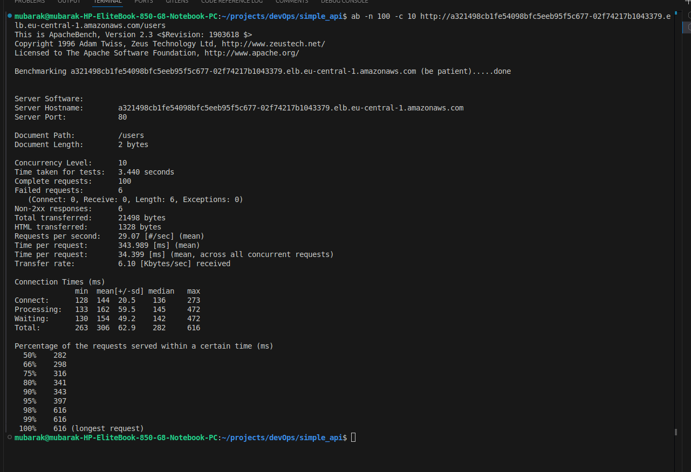

# Simple User Management API with Kubernetes Deployment

This project demonstrates the implementation of a RESTful API deployed to Kubernetes using modern DevOps practices and tools. It includes containerization, Helm-based deployment, and rate limiting implementation.

## Project Structure

```
SIMPLE_API/
├── src/                    # Application source code
│   ├── app.js             # Express API implementation
│   ├── package.json
│   └── package-lock.json
├── deploy/                 # Deployment configurations
│   ├── docker/
│   │   ├── Dockerfile
│   │   └── docker-compose.yml
│   └── helm/
│       └── simple-api/     # Helm chart
│           ├── templates/
│           │   ├── deployment.yaml
│           │   ├── service.yaml
│           │   └── ingress.yaml
│           ├── Chart.yaml
│           ├── values.yaml
│           └── nginx-values.yaml
└── README.md
```

## Components

### 1. Express API ([src/app.js](src/app.js))

A simple User Management API built with Express.js that supports basic CRUD operations:

- POST `/users` - Create a new user
- GET `/users` - Retrieve all users
- PUT `/users/:id` - Update a user
- DELETE `/users/:id` - Delete a user

### 2. Containerization

- Dockerfile ([deploy/docker/Dockerfile](deploy/docker/Dockerfile))

```
cd simple_api
docker build -t mubbyrex/simple-api -f deploy/docker/Dockerfile .
```

- Docker Compose ([deploy/docker/docker-compose.yml](deploy/docker/docker-compose.yml))

### 3. Kubernetes Deployment ([deploy/helm/simple-api/](deploy/helm/simple-api/))

Helm chart components:

- Deployment configuration
- Service configuration
- Ingress with rate limiting

## Rate Limiting Configuration

The application implements rate limiting through NGINX Ingress with the following rules:

- Maximum 10 requests per second per IP
- Maximum 5 concurrent connections per IP
- Burst allowance up to 20 requests per second
- Returns HTTP 429 status code when limits are exceeded

## Deployment

firstly, NGINX ingress controller was installed using helm on the already provisioned AWS EKS cluster

```bash
helm install nginx-ingress ingress-nginx/ingress-nginx \
  -f nginx-values.yaml \
  --namespace ingress-nginx \
  --create-namespace
```

Configuration details for NGINX can be found in the values file ([nginx-values.yaml](deploy/helm/simple-api/nginx-values.yaml))

The deployment utilizes AWS Network Load Balancer instead of an Application Load Balancer because NGINX already handles Layer 7 features(HTTP routing, SSL, etc.) and it has a lower cost

- Deploy the application:

```bash
helm install simple-api ./deploy/helm/simple-api
```

## Testing the Rate Limit

```bash
ab -n 100 -c 10 http://a321498cb1fe54098bfc5eeb95f5c677-02f74217b1043379.elb.eu-central-1.amazonaws.com/users
```



Results:
| Metric | Value | Description |
|--------|--------|-------------|
| Request Rate | 29.07 req/sec | Average throughput |
| Failed Requests | 6 | Due to rate limiting (HTTP 429) |
| Success Rate | 94% | 94 successful requests out of 100 |
| Average Latency | 343.989 ms | Time per request |
| Total Duration | 3.440 sec | Complete test execution |

Conclusion: The rate limiting configuration is working as expected, effectively limiting the number of requests and concurrent connections to the /users endpoint. The server handled the load efficiently, with some requests being rate-limited and receiving 429 status codes.

## Tech Stack

- Node.js/Express
- Docker
- Kubernetes
- Helm
- NGINX Ingress Controller
